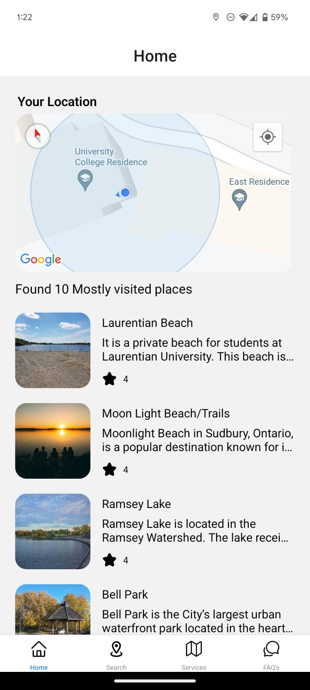

# Laurenation University Mobile App


## Overview

This mobile application was developed for Laurenation University as part of the GTU IEP program. The app is built using React Native and provides a range of features to assist users in navigating Laurenation University and exploring nearby locations.

## Features

- **Current Location:**  
  Use Google Maps API to get the user's current location and display it on the map.

- **Top Locations:**  
  Discover the top locations to travel and visit around Laurenation University. The app lists popular tourist spots, restaurants, and more.

- **Helpline Numbers:**  
  Access important helpline numbers for Laurenation University directly from the app.

- **FAQs Section:**  
  A comprehensive FAQ section addressing common questions and providing helpful information for students and visitors.

## Screenshots



## Installation

1. Clone the repository:
   ```bash
   git clone https://github.com/divyesh-thakur/laurenation-university-app.git
   ```
2. Navigate to the project directory:
   ```bash
   cd laurenation-university-app
   ```
3. Install the dependencies:
   ```bash
   npm install
   ```
4. Run the app on your device/emulator:
   ```bash
   npm run android  # For Android
   npm run ios      # For iOS
   ```

## Usage

Once installed, open the app on your device. The home screen provides quick access to the map feature, where you can view your current location. Explore the app to find top travel locations, helpline numbers, and answers to frequently asked questions.

## Tech Stack

- **React Native:** For building cross-platform mobile applications.
- **Google Maps API:** For fetching and displaying the user's current location on a map.
- **Node.js:** For handling the backend functionalities.

## Contributing

Contributions are welcome.

## Acknowledgments

- Thanks to Laurenation University and GTU IEP program for the opportunity to develop this app.
- Special thanks to the developers and open-source projects that made this app possible.
